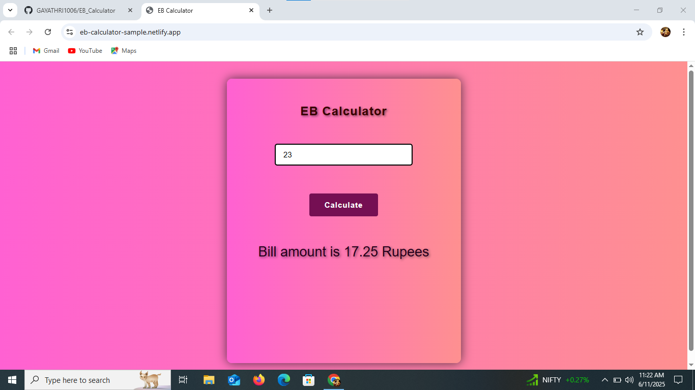

# EB Calculator

A simple Electricity Bill (EB) Calculator web app built using HTML, CSS, and JavaScript. It helps users to calculate their electricity bill based on the number of units consumed using predefined tariff slabs.

##  Demo

👉 [Live Demo](https://eb-calculator-sample.netlify.app/)  

## Developed By
**Gayathri G**  
GitHub: [GAYATHRI1006](https://github.com/GAYATHRI1006)

## Screenshot

  
  

## Features

- Simple and intuitive UI
- Dynamic bill calculation
- Handles empty and invalid input
- Responsive and lightweight

## 💡 Tariff Slabs

| Units       | Rate per Unit | How It's Calculated                        |
|-------------|----------------|---------------------------------------------|
| 0 - 50      | ₹0.75          | units × 0.75                                |
| 51 - 150    | ₹1.00          | ₹37.5 + (units - 50) × 1                    |
| 151 - 250   | ₹1.30          | ₹137.5 + (units - 150) × 1.3                |
| Above 250   | ₹1.50          | ₹267.5 + (units - 250) × 1.5                |

## How to Use

1. Clone or download the repository.
2. Open `index.html` in your browser.
3. Enter the number of electricity units.
4. Click **Calculate**.
5. See your electricity bill displayed below the button.

## Input Validation

- If the input field is empty:  
  `Please enter an input`

- If the input is not a number:  
  `Please enter an input in numbers`

## Technologies Used

- HTML
- CSS
- JavaScript
